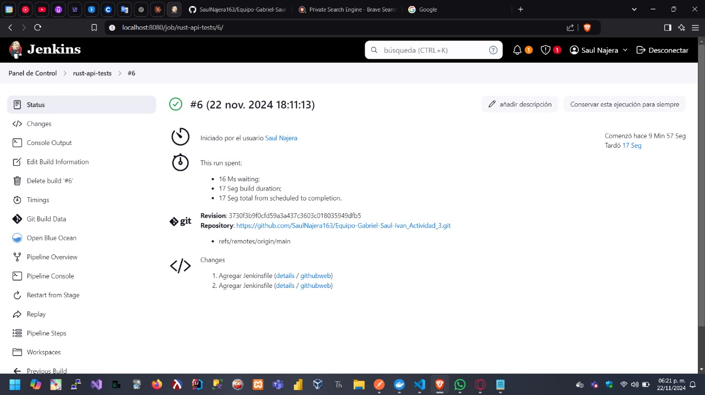

# Proyecto API REST en Rust

Este proyecto es una API REST desarrollada en Rust utilizando el framework Rocket. Permite gestionar información de estudiantes, incluyendo crear, leer, actualizar y eliminar registros.

## Pasos para ejecutar

1. Clona el repositorio:
    ```bash
    git clone https://github.com/SaulNajera163/Equipo-Gabriel-Saul-Ivan_Actividad_3.git
    ```

2. Navega a la carpeta del proyecto:
    ```bash
    cd Equipo-Gabriel-Saul-Ivan_Actividad_3
    ```

3. Construye la imagen Docker:
    ```bash
    docker build -t api_estudiantes .
    ```

4. Levanta el contenedor:
    ```bash
    docker run -d -p 8000:8000 api_estudiantes:latest
    ```

5. La API estará disponible en `http://localhost:8000`.

## Capturas de Pantalla

### 1. Pantalla de la ejecución del pipeline en Jenkins

Aquí mostramos cómo se ejecutó el pipeline:



### 2. Resultados de las pruebas

A continuación, se muestran los resultados de las pruebas ejecutadas:


## Descripción de las funcionalidades

La API permite realizar las siguientes operaciones sobre los estudiantes:

- **GET /estudiantes**: Obtiene la lista de todos los estudiantes.
- **POST /estudiantes**: Agrega un nuevo estudiante.
- **PUT /estudiantes/{numero_control}**: Actualiza la información de un estudiante existente.
- **DELETE /estudiantes/{numero_control}**: Elimina un estudiante de la lista.

## Contribuciones

Si deseas contribuir al proyecto, por favor abre un *pull request*.
