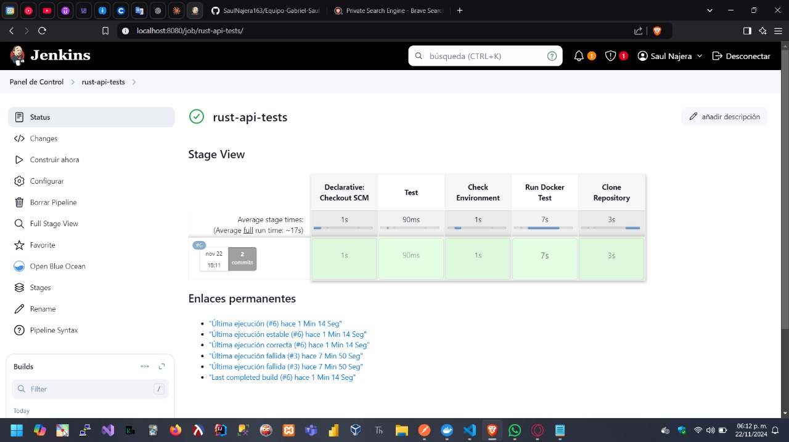

# Proyecto API REST en Rust

Este proyecto es una API REST desarrollada en Rust utilizando el framework Rocket. Permite gestionar información de estudiantes, incluyendo crear, leer, actualizar y eliminar registros.

## Pasos para ejecutar

1. Clona el repositorio:
    ```bash
    git clone https://github.com/SaulNajera163/Equipo-Gabriel-Saul-Ivan_Actividad_3.git
    ```

2. Navega a la carpeta del proyecto:
    ```bash
    cd Equipo-Gabriel-Saul-Ivan_Actividad_3
    ```

3. Construye la imagen Docker:
    ```bash
    docker build -t api_estudiantes .
    ```

4. Levanta el contenedor:
    ```bash
    docker run -d -p 8000:8000 api_estudiantes:latest
    ```

5. La API estará disponible en `http://localhost:8000`.

## Capturas de Pantalla

### 1. Pantalla de la ejecución del pipeline en Jenkins

Aquí mostramos cómo se ejecutó el pipeline:



### 2. Resultados de las pruebas

A continuación, se muestran los resultados de las pruebas ejecutadas:


## Descripción de las funcionalidades

La API permite realizar las siguientes operaciones sobre los estudiantes:

- **GET /estudiantes**: Obtiene la lista de todos los estudiantes.
- **POST /estudiantes**: Agrega un nuevo estudiante.
- **PUT /estudiantes/{numero_control}**: Actualiza la información de un estudiante existente.
- **DELETE /estudiantes/{numero_control}**: Elimina un estudiante de la lista.

## Despliegue en Kubernetes Actividad Final

### Pasos para desplegar en Minikube

1. Iniciar Minikube:
    ```bash
    minikube start
    ```

2. Cargar la imagen de Docker:
    ```bash
    minikube image load api_estudiantes:latest
    ```

3. Aplicar los manifiestos de Kubernetes:
    ```bash
    kubectl apply -f k8s/deployment.yaml
    kubectl apply -f k8s/service.yaml
    ```

4. Verificar los pods:
    ```bash
    kubectl get pods
    ```

5. Acceder al servicio:
    ```bash
    minikube service api-estudiantes-service
    ```

### Detalles del Despliegue

- **Número de Réplicas**: 5 pods
- **Tipo de Servicio**: NodePort
- **Puerto Externo**: 30000

### Capturas del Despliegue

#### Vista de los 5 Pods en Ejecución
[img/pods.png]


#### Servicio de Kubernetes
[img/el_servicio.png]

#### Pruebas en Postman

##### URL del Servicio
[img/url_para_postman.png]


##### Ejemplo de Solicitud GET
[img/get.png]

##### Ejemplo de Solicitud POST
[img/post.png]

## Contribuciones

Alguna duda al proyecto, por favor: 20240559@leon.tecnm.mx